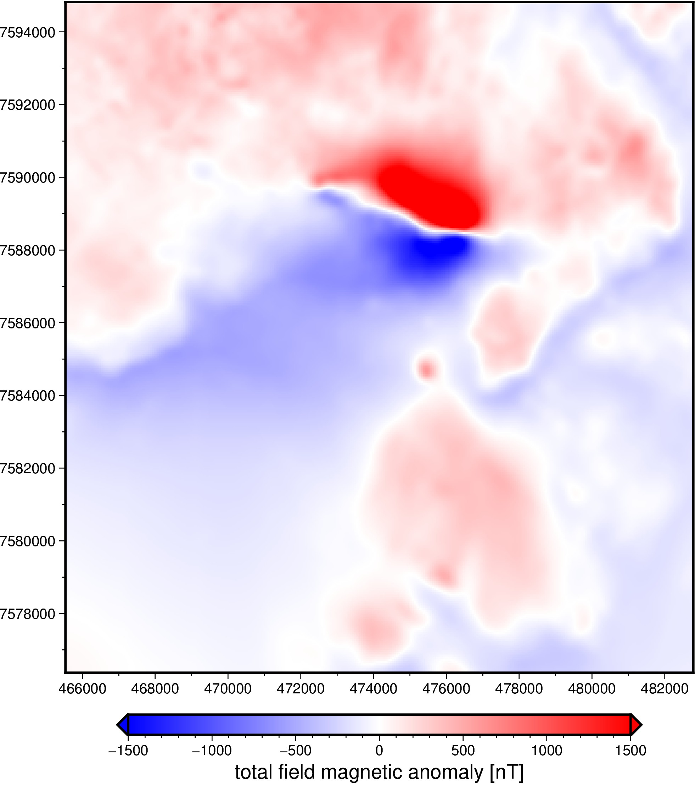

# Lightning Creek Sill Complex, Australia - Airborne total-field magnetic anomaly grid

This is a gridded version of the Lightning Creek anomaly from [our Osborne Mine dataset](https://github.com/fatiando-data/osborne-magnetic). The anomaly is very visible and presents interesting processing and modelling challenges. The grid was generated using [gradient-boosted equivalent sources](https://www.fatiando.org/harmonica/v0.5.1/user_guide/equivalent_sources/gradient-boosted-eqs.html). It's a regular grid in UTM coordinates at a constant height of 500 m. Having the gridded version allows us to use it for FFT-based examples and other applications that require a grid (without having to interpolate every time we need it).

| | Summary |
|--:|:--|
| File | `lightning-creek-magnetic-grid.nc` |
| Size | CHANGEME Mb |
| Version | [v1](https://github.com/fatiando-data/lightning-creek-magnetic-grid/releases/latest) |
| DOI | https://doi.org/CHANGEME |
| License | [CC-BY](https://creativecommons.org/licenses/by/4.0/) |
| MD5 | `md5:CHANGEME` |
| SHA256 | `sha256:CHANGEME` |
| Source | Geophysical Acquisition & Processing Section 2019. MIM Data from Mt Isa Inlier, QLD (P1029), magnetic line data, AWAGS levelled. Geoscience Australia, Canberra. http://pid.geoscience.gov.au/dataset/ga/142419 |
| Original license | [CC-BY](http://pid.geoscience.gov.au/dataset/ga/142419) |
| Processing code | [`prepare.ipynb`](https://nbviewer.org/github/fatiando-data/lightning-creek-magnetic-grid/blob/main/prepare.ipynb) |

## Changes made

> These are the changes made to the original dataset.

* Slice to area of interest.
* Project data to UTM.
* Interpolate to a regular 50 m grid at 500 m height.
* Add CF-compliant metadata to the grid.
* Export to compressed netCDF 4.

## About this repository

This is a place to format and prepare the original dataset for use in our
tutorials and documentation.

We include the source code that prepares the datasets for redistribution by
filtering, standardizing, converting coordinates, compressing, etc.
The goal is to make loading the data as easy as possible (e.g., a single call
to `pandas.read_csv` or `xarray.load_dataset`).
Whenever possible, the code also downloads the original data (otherwise the
original data are included in this repository).

> 💡 **Tip:** The easiest way to download this dataset is using
> [Pooch](https://www.fatiando.org/pooch), particularly to download straight
> from the DOI of a release.

## Contributing

See our [Contributing Guidelines][contrib] for information on proposing new
datasets and making changes to this repository.

## License

All Python source code is made available under the BSD 3-clause license. You
can freely use and modify the code, without warranty, so long as you provide
attribution to the authors.

Unless otherwise specified, all data files and figures created by the code are
available under the Creative Commons Attribution 4.0 License (CC-BY).

See [`LICENSE.txt`](LICENSE.txt) for the full text of each license.

The license for the original data is specified in this `README.md` file.

[contrib]: https://github.com/fatiando-data/.github/blob/main/CONTRIBUTING.md
